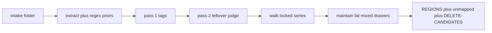

# Burling

**Local handover clerk.** Extract a messy folder. Regex maps identifiers. A
local LLM flags personal leftovers. Then it files each document into one home
on a locked workplace series. A human decides what to delete. The harness
never removes files.

Burling *(textile: picking knots out of cloth)* takes a handover dump and
tells you what is in it — leftover tax forms vs work records — and where a
stranger should look.

[](https://github.com/mbufkin/burling/actions/workflows/ci.yml)
[](LICENSE)

**This is not a de-identification product.** Automated detection misses
identifiers. Keep the original dump offline until a person confirms the list.
See [SECURITY.md](SECURITY.md).



## Install

Python 3.10+ and a local LLM on localhost (Ollama or llama.cpp) for the model
passes. `--priors-only` needs no GPU.

```bash
git clone https://github.com/mbufkin/burling.git
cd burling
pip install -e .
```

Optional: `cp burling/config.example.yaml burling/config.yaml` and edit the
model name. If you skip that, the example config is used.

## Quick start

No GPU, no real files — inventory + regex on the synthetic dump:

```bash
python -m unittest discover -s burling/tests -p "test_*.py"
python -m burling.run --priors-only --intake burling/tests/fixtures/tiny-dump
```

Point at a real folder when you have one. **Do not copy that folder into git.**

```bash
python -m burling.run --intake /path/to/handover
```

That is the ship path: extract → pass 1 → pass 2 leftover judge → walk
organize (one home per file). Resume in slices:

```bash
python -m burling.run --pass 1 --limit 20
python -m burling.run --pass 2 --limit 20
python -m burling.run --walk
python -m burling.run --report
```

## What you get (`output/`)

| File | Role |
| --- | --- |
| `ledger.json` | Source of truth. Redacted priors, tags, leftover judgments. |
| `REGIONS.md` | Browse tree a stranger walks. One home per file. |
| `topic-map.html` | Interactive map of that tree. |
| `walk-state.json` | Resume for `--walk`. |
| `DELETE-CANDIDATES.md` | Pass 2 files to remove **by hand**. |
| `REVIEW-QUEUE.md` | Extract failures + model `review` + not yet scanned. |
| `DOCUMENT-MAP.md` | Pass 1 tags grouped so you can see the dump. |
| `SUMMARY.md` | Counts. |

The ledger stores redacted samples (`***-**-6789`), never the raw SSN.
Empty extracts and files with no subject land in **Unmapped**. A human
decides; the clerk does not invent a 14th series.

## Rules the code enforces

- **Local only.** Non-localhost model URLs are refused. The NVIDIA NIM
  proxy is localhost but forwards off-box — it requires
  `policy.public_corpus` and is 20news-only (`docs/taxonomy-spike.md`).
- **One file, one call.** No shared chat history across the dump.
- **Full text.** Long files are chunked with overlap, then merged.
- **Fail closed** on formatted SSN and Luhn-valid card numbers.
- **Human deletes.** The harness never removes files.
- **One home.** Walk files into the locked workplace series. Combine is a
  later maintain call on fat mixed drawers, names and counts only.

## Not the ship path

These flags remain for experiments. They are not the default `--intake` run.

| Flag | What it was |
| --- | --- |
| `--map` | Place onto `map.yml` facets (program × function × …). |
| `--layers` | Independent 3-layer tags, then one roll-up. |
| `--clerk` | Stitch a plan, then pick one home. |
| `--ralp` | Organize → audit → revise loop. |
| `--spike` | Public 20news staged taxonomy. Requires `policy.public_corpus`. |
| `--census` | Fold mains from ids+counts. |

Spec for walk vs layers: [docs/file-plan-layers.md](docs/file-plan-layers.md).
20news combine findings: [docs/taxonomy-spike.md](docs/taxonomy-spike.md).

## Tests

Same commands as CI. No GPU, no real dump, no cloud API.

```bash
python -m unittest discover -s burling/tests -p "test_*.py"
python -m burling.run --priors-only --intake burling/tests/fixtures/tiny-dump
```

## Hardware

`--priors-only` is CPU. Model passes were developed against a local 7B-class
Ollama model on an 8 GB GPU, and against llama.cpp 30B on a workstation.
Quality of the walk is better on a stronger local model; the records office
(JSON coerce, one home, never delete) does not change.

## License

[MIT](LICENSE)
