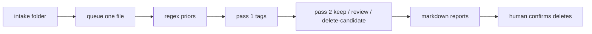

# Burling

**Two-pass local document review.** Regex maps identifiers. A local LLM
flags personal leftovers. A human decides what to delete.

Burling *(textile: picking knots out of cloth)* takes a messy handover folder
and tells you what is in it — then which files look like leftover tax forms,
not work records.

[](https://github.com/mbufkin/burling/actions/workflows/ci.yml)
[](LICENSE)

**This is not a de-identification product.** Automated detection misses
identifiers. Keep the original dump offline until a person confirms the list.
See [SECURITY.md](SECURITY.md).



## Install

Python 3.10+ and [Ollama](https://ollama.com) on localhost (pass 1 / pass 2 only).

```bash
git clone https://github.com/mbufkin/burling.git
cd burling
pip install -e .
```

Optional: `cp burling/config.example.yaml burling/config.yaml` and edit the
model name. If you skip that, the example config is used.

## Quick start

No GPU, no real files — inventory + regex on the synthetic dump:

```bash
python -m burling.run --priors-only --intake burling/tests/fixtures/tiny-dump
```

Or, after install: `burling --priors-only --intake burling/tests/fixtures/tiny-dump`

Point at a real folder when you have one. **Do not copy that folder into git.**

```bash
python -m burling.run --intake /path/to/handover
```

Resume in slices:

```bash
python -m burling.run --pass 1 --limit 20
python -m burling.run --pass 2 --limit 20
python -m burling.run --report
```

## Organize → audit loop (experimental)

`--ralp` is the **R**evise-**A**udit **L**oop for **P**lacement: cluster and
name groups, audit one group at a time, apply moves, let the model split
mixed groups, audit again. It works on **any** folder. See
[docs/ralp-loop.md](docs/ralp-loop.md).

```bash
python -m burling.run --ralp --intake burling/tests/fixtures/sort-sample --ralp-rounds 3
```

Do not point this at a real dump in git.

## Topic map (taxonomy-first)

After pass 1 / pass 2, a full run also places every document onto a
**governed** multi-facet map (`burling/map.yml`) — program × function ×
audience × record_type × lifecycle — the same pattern used in
law/records systems: classify into a known scheme, do not cluster-then-label.

```bash
# Full review + topic map
python -m burling.run --intake /path/to/handover

# Topic map only (queue already built, or with --intake to rebuild)
python -m burling.run --map --intake /path/to/handover
python -m burling.run --map --map-force   # re-place everything
```

Edit `burling/map.yml` to change allowed terms; the model may not invent new ones.

## What you get (`burling/output/`)

| File | Role |
| --- | --- |
| `ledger.json` | Source of truth. Redacted priors, tags, recommendations, placements. |
| `DOCUMENT-MAP.md` | Pass 1 tags grouped so you can see the dump. |
| `TOPIC-MAP.md` | Taxonomy placements by program (handoff aid). |
| `topic-map.html` | Interactive sunburst (switch facets in the browser). |
| `placements.json` | Machine-readable facet placements. |
| `DELETE-CANDIDATES.md` | Pass 2 files to remove **by hand**. |
| `REVIEW-QUEUE.md` | Extract failures + model `review` + not yet scanned. |
| `SUMMARY.md` | Counts. |

The ledger stores redacted samples (`***-**-6789`), never the raw SSN.

## Rules the code enforces

- **Local only.** Non-localhost model URLs are refused.
- **One file, one call.** No shared chat history across the dump.
- **Full text.** Long files are chunked with overlap, then merged.
- **Fail closed** on formatted SSN and Luhn-valid card numbers.
- **Human deletes.** The harness never removes files.

## Tests

```bash
python -m unittest discover -s burling/tests -p "test_*.py"
```

## Hardware

Developed against a consumer NVIDIA GPU with 8 GB VRAM (RTX 3060 Ti) running
Ollama `qwen2.5-coder:7b`. CPU-only `--priors-only` needs no GPU.

## License

[MIT](LICENSE)
